:::{columnn}

:::

:::{column}
[](https://www.gnu.org/licenses/agpl-3.0.en.html) [](http://creativecommons.org/licenses/by-sa/4.0/)
:::

---

```{r}
#| warning: FALSE
#| message: FALSE
#| echo: FALSE
#| include: FALSE

library(dplyr)
library(ggplot2)
library(Luciernaga)
```

---


::: {.notes}
- Single-color unmixing controls
- Unstained unmixing controls
- Full-stained samples

For successful unmixing, a spectral flow cytometry needs three things
This section covers XYZ
:::

---


:::{.notes}
An example of the Cytek Aurora Unmixing Screen
:::

---


::: {.notes}
- What if I gated like this?

- What if I grabbed the entire peak?

- What does this even do again? What if I set it on the adjacent detector?
:::

---


::: {.notes}
Rationale

- Raw Data

- Something something least squares

- Unmixed Data
:::

---


::: {.notes}
Out comes good or bad data
:::

---


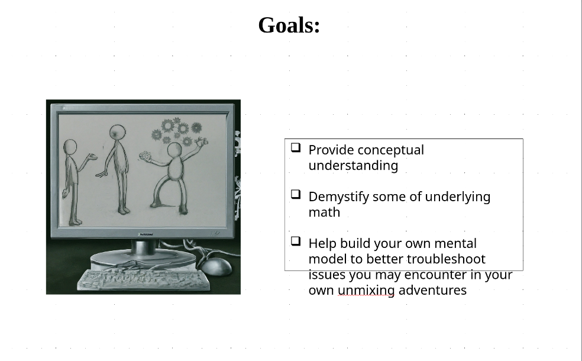


::: {.notes}
Goals

- Provide conceptual understanding

- Demystify some of the underlying math

- Help build your own mental model to better troubleshoot issues you may encounter in your own unmixing adventures
:::

---


::: {.notes}
Let’s go back to the beginning
:::

---


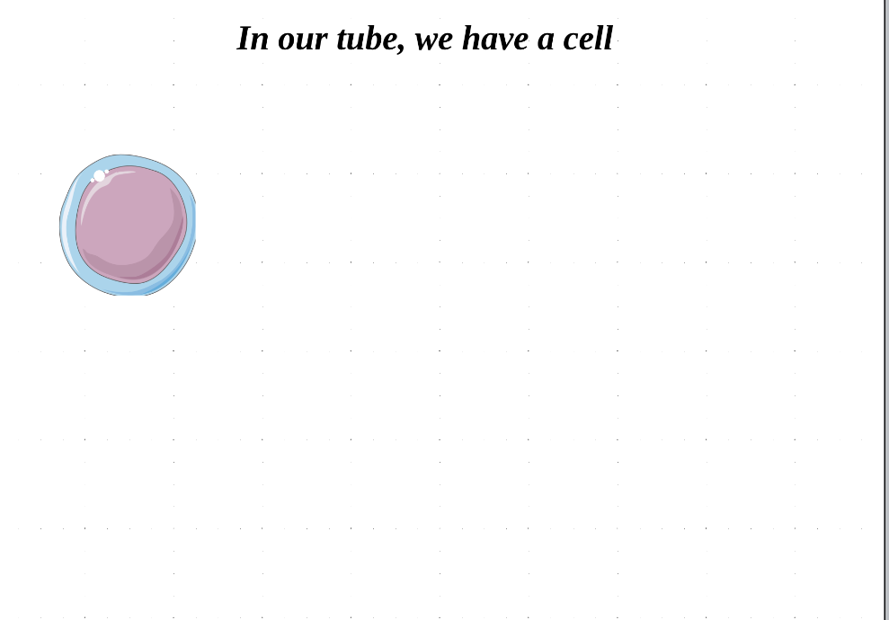


::: {.notes}
In our tube, we have a cell
:::

---


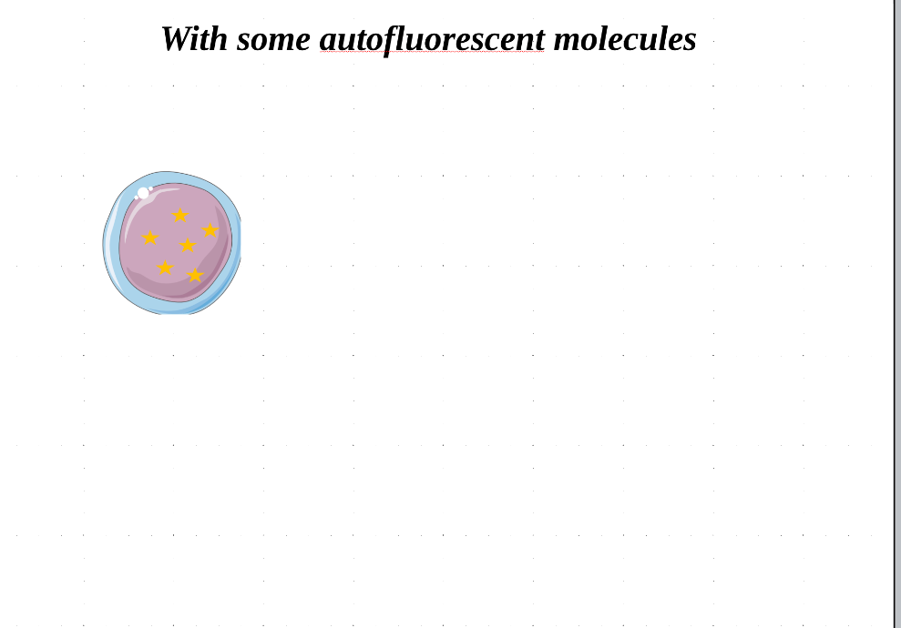


::: {.notes}
With some autofluorescent molecules
:::

---


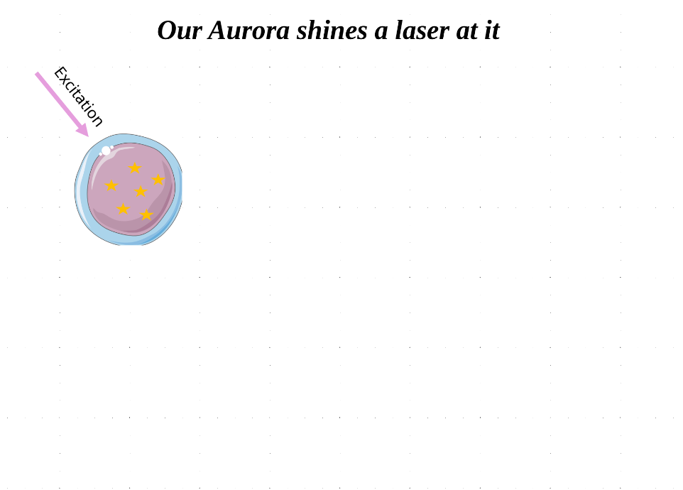


::: {.notes}
Our Aurora shines a laser at it
:::

---


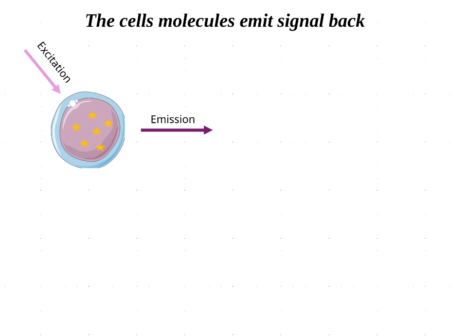


::: {.notes}
The cells molecules emit signal back
:::

---


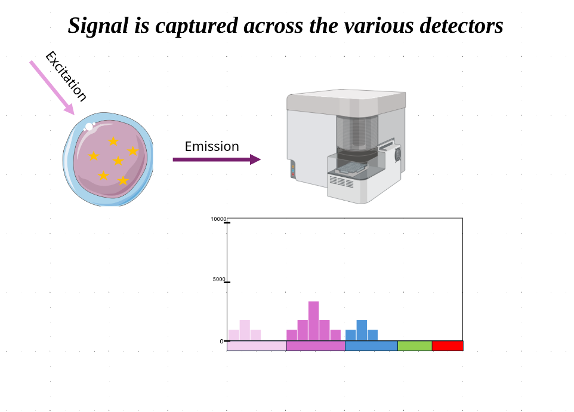


::: {.notes}
Signal is captured across the various detectors
:::

---


---

```{r}
#| echo: FALSE
TheFluorophore <- "PE-Cy5"
Instrument <- 64

DetectorColumns <- Luciernaga:::InstrumentReferences(Instrument) |>
   dplyr::filter(Fluorophore %in% TheFluorophore) |> pull(Detector)

DataWide <- Luciernaga:::InstrumentReferences(Instrument) |>
    select(-Instrument) |> mutate(AdjustedY = AdjustedY * 10000) |> 
    dplyr::filter(Fluorophore %in% TheFluorophore) |>
     tidyr::pivot_wider(names_from="Detector", values_from="AdjustedY")

Plot <- Luciernaga::CartoonSignatures(x=TheFluorophore,
 columnname="Fluorophore", data=DataWide, Normalize=FALSE,
 legend=FALSE, ylim=100000, Expand=FALSE, returnType="Cartoon")
```

```{r}
#| echo: FALSE
plotly::ggplotly(Plot)
```

::: {.notes}
Raw Signal
:::

---


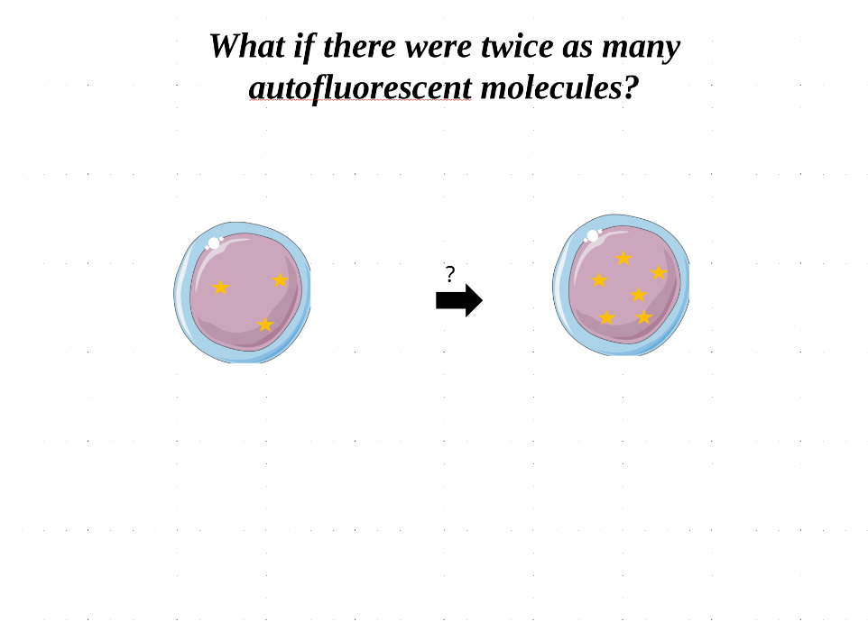


::: {.notes}
What if there were twice as many autofluorescent molecules?
:::

---

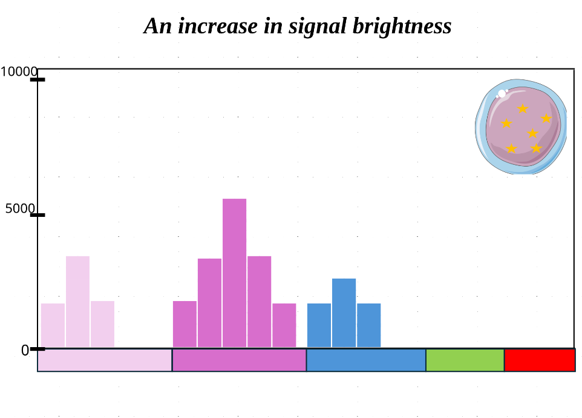

---

```{r}
#| echo: FALSE
TheFluorophore <- "PE-Cy5"
Instrument <- 64

DetectorColumns <- Luciernaga:::InstrumentReferences(Instrument) |>
   dplyr::filter(Fluorophore %in% TheFluorophore) |> pull(Detector)

DataWide <- Luciernaga:::InstrumentReferences(Instrument) |>
    select(-Instrument) |> mutate(AdjustedY = AdjustedY * 10000 * 2) |> 
    dplyr::filter(Fluorophore %in% TheFluorophore) |>
     tidyr::pivot_wider(names_from="Detector", values_from="AdjustedY")

Plot <- Luciernaga::CartoonSignatures(x=TheFluorophore,
 columnname="Fluorophore", data=DataWide, Normalize=FALSE,
 legend=FALSE, ylim=100000, Expand=FALSE, returnType="Cartoon")
```

```{r}
#| echo: FALSE
Plot
```

::: {.notes}
An increase in signal brightness
:::

---


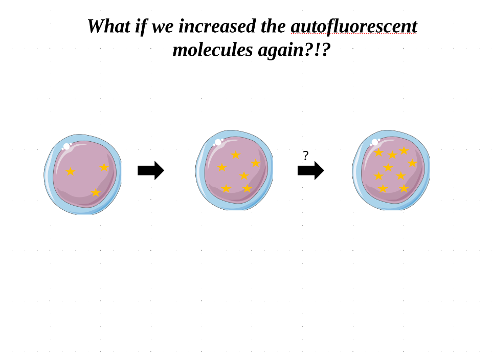


::: {.notes}
What if we increased the autofluorescent molecules again?!?
:::

---

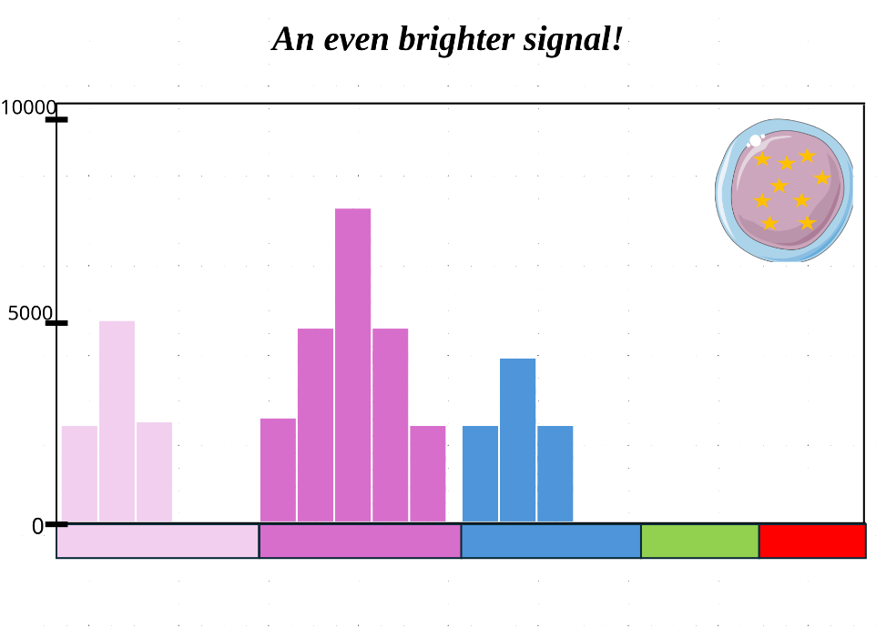

---

```{r}
#| echo: FALSE
TheFluorophore <- "PE-Cy5"
Instrument <- 64

DetectorColumns <- Luciernaga:::InstrumentReferences(Instrument) |>
   dplyr::filter(Fluorophore %in% TheFluorophore) |> pull(Detector)

DataWide <- Luciernaga:::InstrumentReferences(Instrument) |>
    select(-Instrument) |> mutate(AdjustedY = AdjustedY * 10000 * 4) |> 
    dplyr::filter(Fluorophore %in% TheFluorophore) |>
     tidyr::pivot_wider(names_from="Detector", values_from="AdjustedY")

Plot <- Luciernaga::CartoonSignatures(x=TheFluorophore,
 columnname="Fluorophore", data=DataWide, Normalize=FALSE,
 legend=FALSE, ylim=100000, Expand=FALSE, returnType="Cartoon")
```

```{r}
#| echo: FALSE
Plot
```

::: {.notes}
An even brighter signal!
:::

---


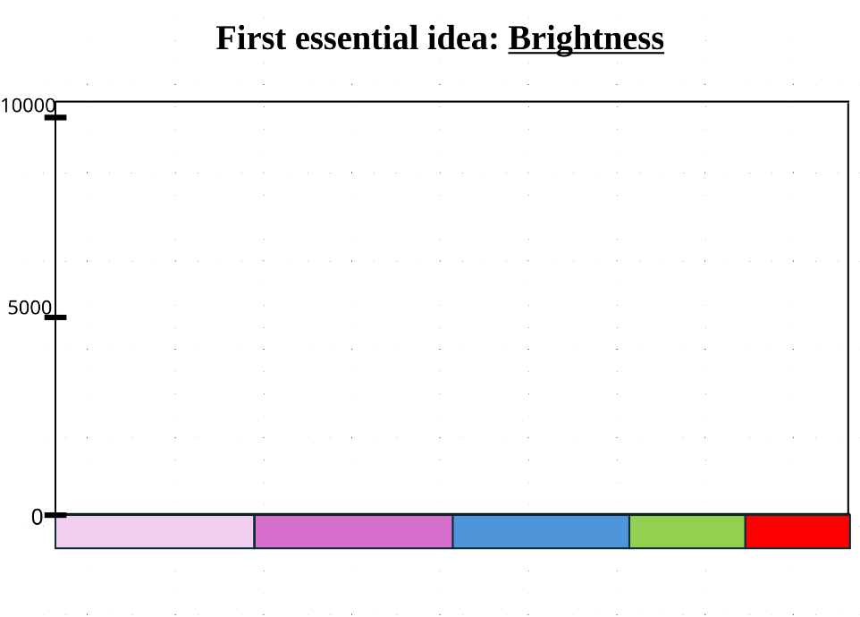


::: {.notes}
First essential idea: Brightness
:::

---


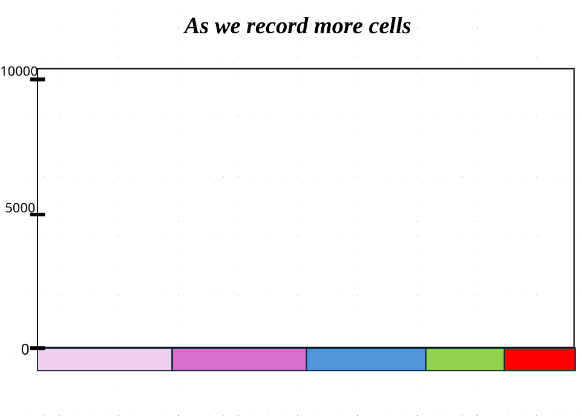


::: {.notes}
As we record more cells
:::

---


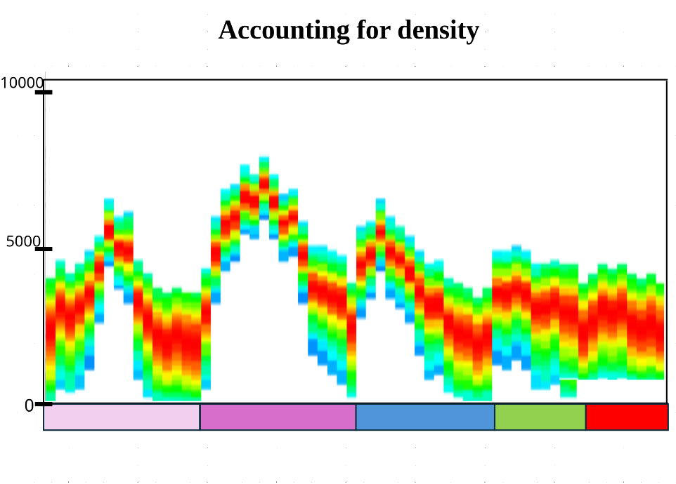


::: {.notes}
Accounting for density
:::

---


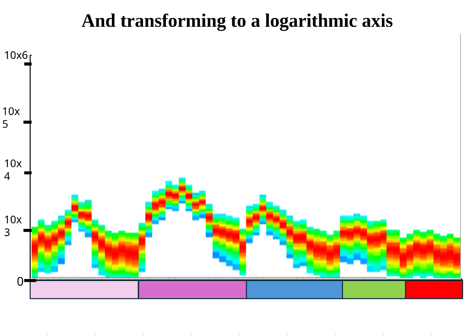


::: {.notes}
And transforming to a logarithmic axis 
:::

---


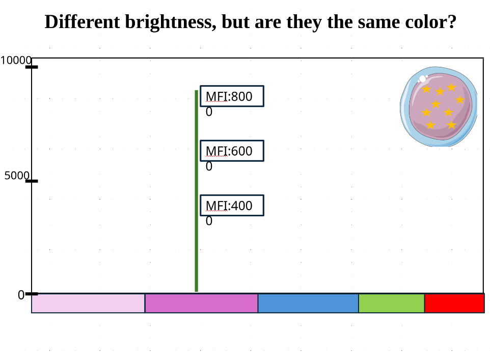


::: {.notes}
Different brightness, but are they the same color?
:::

---


::: {.notes}
Normalizing/Scaling by Peak Detector
:::

---


::: {.notes}
Divide each detectors measurement by the 
peak detectors measurement
:::

---


::: {.notes}
Return the same constants
:::

---


::: {.notes}
Second essential idea: Signature
:::

---


::: {.notes}
Similar with Fluorophores (APC)
:::

---


::: {.notes}
Each Fluorophore has its own characteristic signature
:::

---


::: {.notes}
When we gate for Unstained Reference Control

- The gate we draw

- Selects some cells

- The median measurement per detector is taken

- And used to generate the reference autofluorescent signature
:::

---


::: {.notes}
When we gate for Single-color Controls

- These gated cells

- Make up both positive and negative peaks

- The selected vertical detector is your x-axis

- The cells within the positive gate

- Make up the displayed signature
:::

---


::: {.notes}
And if that wasn’t enough…
:::

---


::: {.notes}
The signal coming from the positive gate in 
our single-color controls is a mixture
:::

---


::: {.notes}
Essential concepts:

- Brightness

- Signature
:::

---


::: {.notes}
How do we isolate the Fluorophore signature?
:::

---


::: {.notes}
What happens with increased autofluorescence?
:::

---


::: {.notes}
What happens if we increase fluorophore staining?!?
:::

---


::: {.notes}
Very low
:::

---


::: {.notes}
Low
:::

---


::: {.notes}
Medium
:::

---


::: {.notes}
High
:::

---


::: {.notes}
When autofluorescence is correctly subtracted

The Fluorophores signature is the same regardless of brightness
:::

---


::: {.notes}
The issue: Variation in autofluorescence

Difference in cell size:
Same proportion of autofluorescent molecules, but because one cell is larger, more of them overall, thus brighter

Difference in amount of autofluorescence:
Same cell size, just one has more autofluorescent molecules, thus brighter

Variation in autofluorescent molecules:
Same cell size, but express different mixture of autofluorescent molecules, resulting in a different autofluorescent signature
:::

---


::: {.notes}
On dim-staining cells:

Dim-staining cell: with correct autofluorescence subtraction

Dim-staining cell: with missed autofluorescence subtraction
:::

---


::: {.notes}
On bright-staining cells:

Bright-staining cell: with correct autofluorescence subtraction

Bright-staining cell: with missed autofluorescence subtraction
:::

---


::: {.notes}
Why would there be leftover autofluorescence signal?

The median measurement from your unstained cells is used.
:::

---


::: {.notes}
At the population level, not everything is “average”

- Our “average”
autofluorescent cell
for the entire population

- Within our single-color reference controls, individual cells may have differences in their expression of autofluorescence molecules. 
:::

---


::: {.notes}
Leftovers after autofluorescence subtraction

- Adventures in Real World Data 
(from my recent experiment)

- Substantial leftover autofluorescence affecting signature for 
dim marker*fluorophore combinations
:::

---


::: {.notes}
Be cautious when using cell controls for dim fluorophores or tertiary markers

- Split the gated cells into 10 groups by percentile, subtracted autofluorescence, and then normalized

- ncreasing leftover autofluorescence as 
you gate further left
:::

---


::: {.notes}
In terms of the fluorophore signature used for unmixing

- When gating single-color controls, the brightest staining cells are more resilient to signature changes due to leftoversWhen gating single-color controls, the brightest staining cells are more resilient to signature changes due to leftovers 
:::

---


::: {.notes}
One major exception: Antibody aggregates!
:::

---


::: {.notes}
Not all problems are due to autofluorescence
:::

---


::: {.notes}
Your fluorophores can also vary in 
their signature!!! 

- Manufacturer Lot Variation
- Cross-pollinating BUV and BV fluorophores
- Tandem degradation
- FRET

But that’s a problem for Thursday’s Single Color and Autofluorescence Troubleshooting session. 
:::

---


::: {.notes}
For now: The three rules for good unmixing controls

- The single stained control must be as bright or brighter than the fully stained sample.

- The exact same fluorophore must be used the stain the control and the fully stained sample.


-  Background autofluorescence should be the same for the positive and negative control
:::

---


::: {.notes}
Every reference control provides an unique signature

Then what happens?
:::

---


::: {.notes}
Each unique signature becomes a reference vector
:::

---


::: {.notes}
Wait a second…. Vector…
:::

---


::: {.notes}
It’s not magic….
:::

---


::: {.notes}
It’s math!

Which for biologist might as well be magic
:::

---


::: {.notes}
So lets try to demystify some of underlying math
:::

---


::: {.notes}
A two-detector vector
:::

---


::: {.notes}
Finding a linear combination of Blue and Green that gives us the total
:::

---


::: {.notes}
Viewed differently:
:::

---


::: {.notes}
A three-detector vector
:::

---


::: {.notes}
Where David’s Art Skills End
:::

---


::: {.notes}
Lines (or planes) flying through space
:::

---


::: {.notes}
Also explains: Presence or Absence
:::

---


::: {.notes}
Beyond three-dimensions
:::

---


::: {.notes}
Final Math Details:

- In the above examples, we had the same number of detectors as fluorophores. The matrix generated by collecting the signatures from your single-color controls is a square. This is the case with conventional Flow Cytometry.

- In Spectral Flow Cytometry, we have more detectors than Fluorophores. The matrix generated by collecting the signatures from your single-color controls is a rectangle. This is called an overdetermined system. With rare exceptions, these can’t be solved exactly. 

- However, they can be approximated, which is where some variation of least-square algorithm is used (ordinary least squares in SpectroFlos case)
:::

---


::: {.notes}
If you want to learn more:
:::

---


::: {.notes}
A spectral cytometer needs three things 
for successful unmixing:
:::

---


:::{.notes}
Unmixing’s Quandaries

-  Each cell in your full-stained sample is unmixed individually… 
- Presence (or absence) of each Fluorophore
- Relative expression of each Fluorophore

By referencing the unique signatures
from the unstained & single-color reference controls…

Which are derived from taking the mean/median fluorescence measurement of a gated population of reference cells…

….after first subtracting out background autofluorescent signature based on a gated population of unstained cells.

Variation here will
impact your unmixing results
:::

---

# Code Examples

---

```{r}
#| code-fold: TRUE

TheFluorophore <- "PerCP-Cy5.5"

DetectorColumns <- Luciernaga:::InstrumentReferences(64) |>
   dplyr::filter(Fluorophore %in% TheFluorophore) |> pull(Detector)

DataWide <- Luciernaga:::InstrumentReferences(64) |> select(-Instrument) |> mutate(AdjustedY = AdjustedY * 10000) |> dplyr::filter(Fluorophore %in% TheFluorophore) |> tidyr::pivot_wider(names_from="Detector", values_from="AdjustedY")

Plot <- Luciernaga::CartoonSignatures(x=TheFluorophore, columnname="Fluorophore",
 data=DataWide, Normalize=FALSE, legend=FALSE, ylim=15000, Expand=10000, variance = "high", returnType="Density", logScale=FALSE)
```

```{r}
#| eval: FALSE
plotly::ggplotly(Plot)
```

---

```{r}
#| code-fold: TRUE
TheFluorophore <- "PerCP-Cy5.5"

DetectorColumns <- Luciernaga:::InstrumentReferences(64) |>
   dplyr::filter(Fluorophore %in% TheFluorophore) |> pull(Detector)

DataWide <- Luciernaga:::InstrumentReferences(64) |> select(-Instrument) |> mutate(AdjustedY = AdjustedY * 10000) |> dplyr::filter(Fluorophore %in% TheFluorophore) |> tidyr::pivot_wider(names_from="Detector", values_from="AdjustedY")

Plot <- Luciernaga::CartoonSignatures(x=TheFluorophore, columnname="Fluorophore",
 data=DataWide, Normalize=FALSE, legend=FALSE, ylim=15000, Expand=100, returnType="Amalgamated")
```

```{r}
plotly::ggplotly(Plot)
```

---

```{r}
#| code-fold: TRUE
TheFluorophore <- "PerCP-Cy5.5"

DetectorColumns <- Luciernaga:::InstrumentReferences(64) |>
   dplyr::filter(Fluorophore %in% TheFluorophore) |> pull(Detector)

DataWide <- Luciernaga:::InstrumentReferences(64) |> select(-Instrument) |> mutate(AdjustedY = AdjustedY * 10000) |> dplyr::filter(Fluorophore %in% TheFluorophore) |> tidyr::pivot_wider(names_from="Detector", values_from="AdjustedY")

Plot <- Luciernaga::CartoonSignatures(x=TheFluorophore, columnname="Fluorophore",
 data=DataWide, Normalize=FALSE, legend=FALSE, ylim=15000)
```

```{r}
#| code-fold: TRUE
plotly::ggplotly(Plot)
```

---

```{r}
#| code-fold: TRUE
TheFluorophore <- "PerCP-Cy5.5"

DetectorColumns <- Luciernaga:::InstrumentReferences(64) |>
   dplyr::filter(Fluorophore %in% TheFluorophore) |> pull(Detector)

DataWide <- Luciernaga:::InstrumentReferences(64) |> select(-Instrument) |> mutate(AdjustedY = AdjustedY * 10000) |> dplyr::filter(Fluorophore %in% TheFluorophore) |> tidyr::pivot_wider(names_from="Detector", values_from="AdjustedY")

Plot <- Luciernaga::CartoonSignatures(x=TheFluorophore, columnname="Fluorophore",
 data=DataWide, Normalize=TRUE, legend=FALSE)
```

```{r}
#| code-fold: TRUE
plotly::ggplotly(Plot)
```


